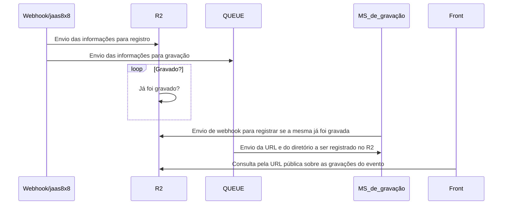

```mermaid
sequenceDiagram
Webhook/jaas8x8->>R2: Envio das informações para registro
Webhook/jaas8x8->>QUEUE: Envio das informações para gravação
loop Gravado?
R2->>R2: Já foi gravado?
end
MS_de_gravação->>R2: Envio de webhook para registrar se a mesma já foi gravada
QUEUE->>MS_de_gravação: Envio da URL e do diretório a ser registrado no R2
Front->>R2: Consulta pela URL pública sobre as gravações do evento
```
